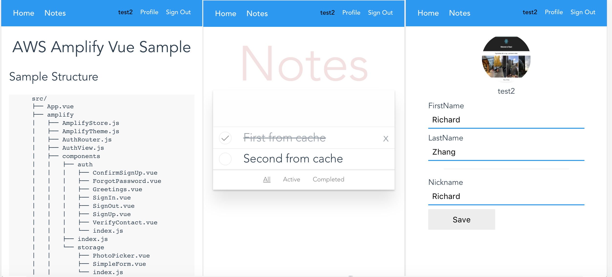

# AWS Amplify Vue Starter

A VueJs starter app integrated with [aws-amplify](https://github.com/aws/aws-amplify). **Please submit issues to the [aws-amplify](https://github.com/aws/aws-amplify/issues) repository**.



* [Getting Started](#getting-started)
* [AWS Amplify Integration Explained](#aws-amplify-integration-explained)
  - [Setup AWS Amplify](#setup-aws-amplify)
  - [Auth Routing](#auth-routing)
  - [Storage Components](#storage-components)
* [License](#license)

## Getting Started

1. Clone project and install dependencies    

```bash
$ git clone https://github.com/aws-samples/aws-amplify-vue.git
$ cd aws-amplify-vue
$ npm install
```

2. Copy your `aws-exports` file into the src directory, or intialize a new [AWS Amplify CLI](https://github.com/aws-amplify/amplify-cli) project:

```bash
$ npm install -g @aws-amplify/cli

$ amplify init

$ amplify add auth
$ > Yes, use the default configuration.

$ amplify add storage
$ > Content (Images, audio, video, etc.)
...
$ > Auth users only
$ > read/write

$ amplify add api
$ > GraphQL
...
$ > Amazon Cognito User Pool
$ Do you have an annotated GraphQL schema? N
$ Do you want a guided schema creation? Y
$ > Single object with fields (e.g. "Todo" with id, name description)
$ Do you want to edit the schema now? Y

  type Todo @model {
  id: ID!
  note: String!
  done: Boolean
}

$ amplify push
$ Do you want to generate code for your newly created GraphQL API N

```

3. Start the project    

```bash
$ npm start
```

Check http://localhost:8080/


### Setup AWS Amplify

It is recommended to configure Amplify library at the entry point of application. Here we choose `main.js`

```js
import Amplify from 'aws-amplify';
import { components } from 'aws-amplify-vue'; 
import aws_exports from './aws-exports'

...

Amplify.configure(aws_exports)

...

new Vue({
  el: '#app',
  router: router,
  template: '<App/>',
  components: { 
    App,
    ...components
  }
})

```

We then install the AmplifyPlugin in the application's ```router/index.js``` file:

```
import { AmplifyPlugin } from 'aws-amplify-vue';

...


Vue.use(AmplifyPlugin, AmplifyModules);

```

This makes the Amplify library available throughout the application as a Vue Plugin.

### Authentication Components

This sample uses three auth-related components from the `aws-amplify-vue` package:

* Authenticator
  - allows new users to signup, signin, and complete verification/multifactor authentication steps.
  - included in the router as the default route that is shown when the user is not logged in.

* SetMFA
  - included in the profile page
  - allows users to select their preferred MFA types
  - you can configure the MFA options that are dispayed in the SetMFA component by binding a mfaConfig object to the component like so:
  ```
  <amplify-set-mfa v-bind:mfaConfig="mfaConfig"></amplify-set-mfa>

  ...

  mfaConfig = {
    mfaTypes: ['SMS', 'TOTP', 'None']
  }
  
  ```

### Storage Components

In this sample, `src/amplify` package register a group of Amplify related components. Other than Auth components, there are two storage related components:

* PhotoPicker
  - showcase usage of Amplify Storage on binary data uploads
* S3Image
  - showcase usage of Amplify Storage on binary data display

### Logging

This application uses verbose [logging](https://aws-amplify.github.io/amplify-js/media/logger_guide#logger) by default.  You can change the log level by altering the line ```window.LOG_LEVEL = 'VERBOSE';``` in ```App.vue```.

## License

This library is licensed under the Apache 2.0 License. 
